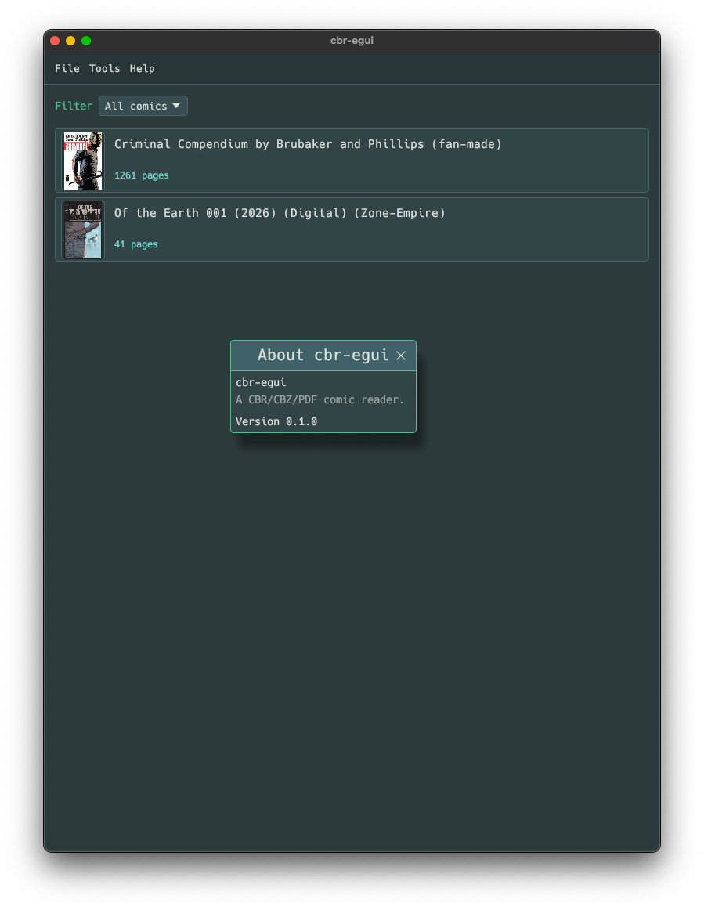

# cbr-egui

A native CBR / CBZ / PDF comic reader built in Rust with [egui].



## Features

- **Library**: import individual files or whole folders; comics are copied
  into a content-addressed managed store so the library remains valid even
  if the originals move. Filter by series or folder, switch between
  thumbnail and list views, and pull up a collapsible shelf for quick
  navigation.
- **Reader**: paged or continuous-vertical layout, two-page spread, fit /
  fill / width / height / 1:1 zoom presets, smooth zoom + pan, rotation,
  bookmarks, and per-page progress tracking.
- **Image adjustments**: brightness, contrast, gamma, grayscale mix, and a
  value-study mode that posterizes luma into 2–8 bands.
- **Familiar menu bar**: File / Tools / Options / Help in both the library
  and reader views.
- **Library toolbar**: one-click buttons for Add Files, Add Folder,
  Thumbnails / List view, Shelf, Select mode, and the series / folder filter.
- **Right-click any comic** for "Mark as read / unread" and "Open file
  location" (reveals the source file in the OS file manager).
- Resumes the last reading session on launch, and restores each comic to the
  page you left off on when you reopen it (toggle in Settings).
- **Keyboard shortcuts** for every reader action, listed in-app under
  Help > Keyboard Shortcuts and in the table below.

## Keyboard shortcuts

These apply while reading a comic. The same list is available in-app from
Help > Keyboard Shortcuts.

### Navigation

| Key | Action |
|-----|--------|
| `Right` / `Page Down` | Next page |
| `Left` / `Page Up` | Previous page |
| `Space` / `Down` | Scroll down |
| `Up` | Scroll up |
| `Home` | First page |
| `End` | Last page |
| `Esc` | Back to library |

### View and zoom

| Key | Action |
|-----|--------|
| `F` | Fit to window |
| `Shift` + `F` | Fill window |
| `W` | Fit width |
| `H` | Fit height |
| `1` | Actual size (1:1) |
| `+` / `=` | Zoom in |
| `-` | Zoom out |
| `S` | Toggle two-page spread |
| `V` | Toggle continuous scroll |
| `R` | Rotate right |
| `Shift` + `R` | Rotate left |

### Bookmarks

| Key | Action |
|-----|--------|
| `B` | Toggle bookmark on current page |

## Supported formats

| Extension | Backend |
|-----------|---------|
| `.cbz` / `.zip` | [`zip`] |
| `.cbr` / `.rar` | [`unrar`] |
| `.pdf` | [`pdfium-render`] |

## Building

Requires a recent stable Rust toolchain (2024 edition).

```sh
cargo run --release
```

PDF rendering requires the `pdfium` shared library to be available at
runtime — see the [pdfium-render docs][pdfium-render] for platform setup.

## Tests

```sh
cargo test
```

## Project layout

- `src/app/` — application shell, library view, reader routing.
- `src/viewer/` — viewport state, layout math, page rendering.
- `src/decode/` — image decode pipeline (rotation, adjustments, worker pool).
- `src/library/` — managed store, import, SQLite-backed metadata.
- `src/cache/` — page texture cache.
- `src/vfs/` — archive readers (zip / rar / pdf).
- `tests/` — integration tests.

[egui]: https://github.com/emilk/egui
[`zip`]: https://crates.io/crates/zip
[`unrar`]: https://crates.io/crates/unrar
[pdfium-render]: https://crates.io/crates/pdfium-render
